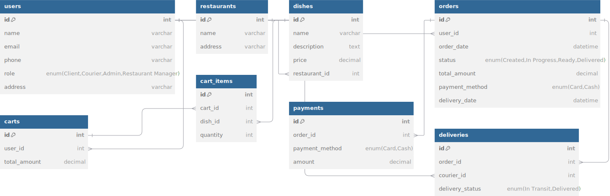

## Роли пользователей и их действия
+ **Администратор**
    - Управление пользователями (создание, редактирование, удаление);
    - Управление меню (добавление, изменение, удаление блюд);
    - Обработка заказов (изменение статуса заказов, назначение курьеров);
    - Просмотр отчетов и статистики.
+ **Курьер**
    - Получение и выполнение заказов (обновление статуса доставки);
    - Просмотр списка назначенных заказов.

+ **Клиент**
    - Регистрация и авторизация;
    - Создание заказа (выбор блюд, добавление в корзину);
    - Оплата заказа;
    - Отслеживание статуса заказа;
    - Оценка блюд и качества доставки.
+ **Менеджер ресторана**
    - Управление меню (добавление, редактирование блюд);
    - Просмотр заказов, сделанных в их ресторане;
    - Обработка заказов (готовка и передача курьеру);
    - Просмотр статистики по заказам.

## Объекты данных
+ **Пользователь**
    - id (уникальный идентификатор);
    - имя;
    - email;
    - телефон;
    - роль (Клиент, Курьер, Администратор, Менеджер ресторана);
    - адрес доставки (для клиента).

+ **Блюдо**
    - id (уникальный идентификатор);
    - название;
    - описание;
    - цена;
    - ресторан (связь с рестораном).

+ **Заказ**
    - id (уникальный идентификатор);
    - пользователь (связь с пользователем);
    - дата и время создания;
    - статус (например, создан, в процессе, готов, доставлен);
    - общая сумма;
    - метод оплаты (например, карта, наличные);
    - дата и время доставки (если доставлен).

+ **Корзина**
    - id (уникальный идентификатор);
    - пользователь (связь с пользователем);
    - список блюд (связь с блюдами);
    - общая сумма.

+ **Ресторан**
    - id (уникальный идентификатор);
    - название;
    - адрес;
    - меню (связь с блюдами).

+ **Оплата**
    - id (уникальный идентификатор);
    - заказ (связь с заказом);
    - метод оплаты;
    - сумма.

+ **Доставка**
    - id (уникальный идентификатор);
    - заказ (связь с заказом);
    - курьер (связь с курьером);
    - статус доставки (например, в пути, доставлено).

## Связи между объектами
+ **Пользователь ↔ Заказ** \
Один пользователь может сделать несколько заказов. Каждый заказ связан с одним пользователем.
+ **Заказ ↔ Блюдо** \
Каждый заказ может включать несколько блюд. Это связь многие ко многим (каждое блюдо может быть в нескольких заказах).
+ **Ресторан ↔ Блюдо** \
Один ресторан может предлагать несколько блюд.
+ **Корзина ↔ Блюдо** \
Один пользователь может добавить несколько блюд в корзину.
+ **Заказ ↔ Оплата** \
Один заказ связан с одной оплатой, но оплата может быть частичной или полной.
+ **Заказ ↔ Доставка** \
Один заказ связан с одной доставкой, и доставка может быть выполнена одним курьером.

## Схема объектной модели
