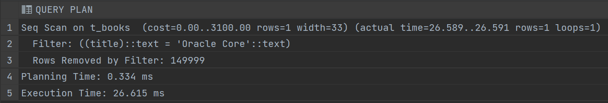
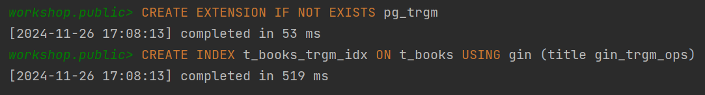

# Задание 1. B-tree индексы в PostgreSQL

1. Запустите БД через docker compose в ./src/docker-compose.yml:

2. Выполните запрос для поиска книги с названием 'Oracle Core' и получите план выполнения:
   ```sql
   EXPLAIN ANALYZE
   SELECT * FROM t_books WHERE title = 'Oracle Core';
   ```
   
   *План выполнения:*
   
   
   *Объясните результат:* 
   отсутствие индекса приводит к полному сканированию (`Seq Scan`)

3. Создайте B-tree индексы:
   ```sql
   CREATE INDEX t_books_title_idx ON t_books(title);
   CREATE INDEX t_books_active_idx ON t_books(is_active);
   ```
   
   *Результат:*
   

4. Проверьте информацию о созданных индексах:
   ```sql
   SELECT schemaname, tablename, indexname, indexdef
   FROM pg_catalog.pg_indexes
   WHERE tablename = 't_books';
   ```
   
   *Результат:*
   
   
   *Объясните результат:*
   после выполнения команды из `п.3`, в таблице появились 2 новых индекса (2 и 3 строки)

5. Обновите статистику таблицы:
   ```sql
   ANALYZE t_books;
   ```
   
   *Результат:* \
    

6. Выполните запрос для поиска книги 'Oracle Core' и получите план выполнения:
   ```sql
   EXPLAIN ANALYZE
   SELECT * FROM t_books WHERE title = 'Oracle Core';
   ```
   
   *План выполнения:*
    
   
   *Объясните результат:*
   использован индекс `t_books_title_idx`, поэтому время исполнения уменьшилось примерно в 26 раз

7. Выполните запрос для поиска книги по book_id и получите план выполнения:
   ```sql
   EXPLAIN ANALYZE
   SELECT * FROM t_books WHERE book_id = 18;
   ```
   
   *План выполнения:*
    
   
   *Объясните результат:*
   использован индекс `PRIMARY KEY`. Видно, что использование такого индекса сильно уменьшает время планирования (примерно в 12 раз)

8. Выполните запрос для поиска активных книг и получите план выполнения:
   ```sql
   EXPLAIN ANALYZE
   SELECT * FROM t_books WHERE is_active = true;
   ```
   
   *План выполнения:*
    
   
   *Объясните результат:*
   был выполнен поиск по всей таблице (`Seq Scan`), индекс `t_books_active_idx` не использовался. Это произошло, потому что слишком много строк (примерно половина) удовлетворяют условию.

9. Посчитайте количество строк и уникальных значений:
   ```sql
   SELECT 
       COUNT(*) as total_rows,
       COUNT(DISTINCT title) as unique_titles,
       COUNT(DISTINCT category) as unique_categories,
       COUNT(DISTINCT author) as unique_authors
   FROM t_books;
   ```
   
   *Результат:*
    

10. Удалите созданные индексы:
    ```sql
    DROP INDEX t_books_title_idx;
    DROP INDEX t_books_active_idx;
    ```
    
    *Результат:*
    

11. Основываясь на предыдущих результатах, создайте индексы для оптимизации следующих запросов:
    a. `WHERE title = $1 AND category = $2`
    b. `WHERE title = $1`
    c. `WHERE category = $1 AND author = $2`
    d. `WHERE author = $1 AND book_id = $2`
    
    *Созданные индексы:*
    ```sql
    CREATE INDEX t_books_title_category_idx ON t_books(title, category);
    CREATE INDEX t_books_category_author_idx ON t_books(category, author);
    CREATE INDEX t_books_author_bookid_idx ON t_books(author, book_id);
    ```
    
    *Объясните ваше решение:*
    [Ваше объяснение]

12. Протестируйте созданные индексы.
    ```sql
    EXPLAIN ANALYZE
    SELECT * FROM t_books WHERE title = 'Oracle Core' AND category = 'Databases';

    EXPLAIN ANALYZE
    SELECT * FROM t_books WHERE title = 'Oracle Core';

    EXPLAIN ANALYZE
    SELECT * FROM t_books WHERE category = 'Databases' AND author = 'Jonathan Lewis';

    EXPLAIN ANALYZE
    SELECT * FROM t_books WHERE author = 'Jonathan Lewis' AND book_id = 3001;
    ```
    
    *Результаты тестов:*
    
    
    
    
    
    *Объясните результаты:*
    первый, третий и четвертый запрос ожидаемо используют созданные комбинированные индексы. Второй запрос использует индекс, созданный _как бы_ для первого, потому что он выполняет поиск по `title`

13. Выполните регистронезависимый поиск по началу названия:
    ```sql
    EXPLAIN ANALYZE
    SELECT * FROM t_books WHERE title ILIKE 'Relational%';
    ```
    
    *План выполнения:*
    
    
    *Объясните результат:*
    используется `Seq Scan`, т.к. созданный индекс не поддерживает операцию поиска по регистронезависимому шаблону

14. Создайте функциональный индекс:
    ```sql
    CREATE INDEX t_books_up_title_idx ON t_books(UPPER(title));
    ```
    
    *Результат:*
    

15. Выполните запрос из шага 13 с использованием UPPER:
    ```sql
    EXPLAIN ANALYZE
    SELECT * FROM t_books WHERE UPPER(title) LIKE 'RELATIONAL%';
    ```
    
    *План выполнения:*
    

    
    *Объясните результат:*
    все равно используется `Seq Scan`. Я подозреваю, что проблема в функции `LIKE`, т.к. если выполнить
    ```sql
    EXPLAIN ANALYZE
    SELECT * FROM t_books WHERE UPPER(title) = 'RELATIONAL';
    ```
    
    индекс используется

16. Выполните поиск подстроки:
    ```sql
    EXPLAIN ANALYZE
    SELECT * FROM t_books WHERE title ILIKE '%Core%';
    ```
    
    *План выполнения:*
    
    
    *Объясните результат:*
    аналогично заданию 13, не поддерживается регистронезависимый поиск

17. Попробуйте удалить все индексы:
    ```sql
    DO $$ 
    DECLARE
        r RECORD;
    BEGIN
        FOR r IN (SELECT indexname FROM pg_indexes 
                  WHERE tablename = 't_books' 
                  AND indexname != 'books_pkey')
        LOOP
            EXECUTE 'DROP INDEX ' || r.indexname;
        END LOOP;
    END $$;
    ```
    
    *Результат:*
    
    
    
    *Объясните результат:*
    Postgres не дает нам удалить индекс, связанный с первичным ключом, а из-за того, что он в списке индексов первый, остальные тоже остались нетронутыми

18. Создайте индекс для оптимизации суффиксного поиска:
    ```sql
    -- Вариант 1: с reverse()
    CREATE INDEX t_books_rev_title_idx ON t_books(reverse(title));
    
    -- Вариант 2: с триграммами
    CREATE EXTENSION IF NOT EXISTS pg_trgm;
    CREATE INDEX t_books_trgm_idx ON t_books USING gin (title gin_trgm_ops);
    ```
    
    *Результаты тестов:*
    
    
    
    
    
    *Объясните результаты:*
    индекс с `reverse()` нам ничего не дал, а вот триграммы вызвали `Bitmap Heap Scan`, что ускорило запрос примерно в 1120 раз

19. Выполните поиск по точному совпадению:
    ```sql
    EXPLAIN ANALYZE
    SELECT * FROM t_books WHERE title = 'Oracle Core';
    ```
    
    *План выполнения:*
    
    
    *Объясните результат:*
    использован индекс `t_books_title_category_idx`, т.к. он в себе содержит `title`

20. Выполните поиск по началу названия:
    ```sql
    EXPLAIN ANALYZE
    SELECT * FROM t_books WHERE title ILIKE 'Relational%';
    ```
    
    *План выполнения:*
    
        
    *Объясните результат:*
    использован `Bitmap Heap Scan` благодаря триграммам

21. Создайте свой пример индекса с обратной сортировкой:
    ```sql
    CREATE INDEX t_books_desc_idx ON t_books(title DESC);
    ```
    
    *Тестовый запрос:*
    ```sql
    EXPLAIN ANALYZE
    SELECT * FROM t_books ORDER BY title DESC;
    ```
    
    *План выполнения:*
    
        
    *Объясните результат:*
    используется созданный индекс, который предоставляет данные уже отсортированными, что сильно уменьшает время выполнения запроса
