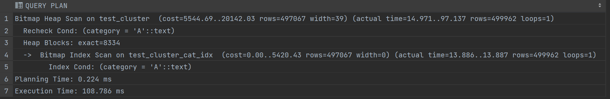
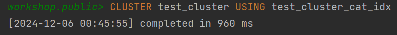
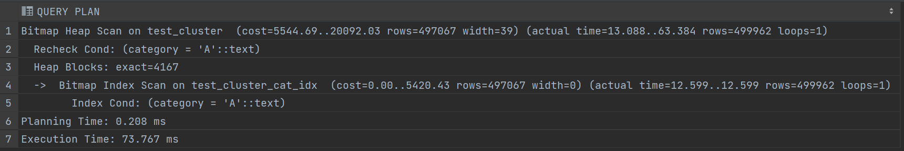

## Задание 3

1. Создайте таблицу с большим количеством данных:
    ```sql
    CREATE TABLE test_cluster AS 
    SELECT 
        generate_series(1,1000000) as id,
        CASE WHEN random() < 0.5 THEN 'A' ELSE 'B' END as category,
        md5(random()::text) as data;
    ```

2. Создайте индекс:
    ```sql
    CREATE INDEX test_cluster_cat_idx ON test_cluster(category);
    ```

3. Измерьте производительность до кластеризации:
    ```sql
    EXPLAIN ANALYZE
    SELECT * FROM test_cluster WHERE category = 'A';
    ```
    
    *План выполнения:*
    
    
    *Объясните результат:*
    используется `Bitmap Index Scan` по созданному в п. 2 индексу. Время выполнения (аж?) 108.768мс 

4. Выполните кластеризацию:
    ```sql
    CLUSTER test_cluster USING test_cluster_cat_idx;
    ```
    
    *Результат:*
    

5. Измерьте производительность после кластеризации:
    ```sql
    EXPLAIN ANALYZE
    SELECT * FROM test_cluster WHERE category = 'A';
    ```
    
    *План выполнения:*
    
    
    *Объясните результат:*
    использован `Bitmap Index Scan` по созданному тому же индексу. Теперь время выполнения 73.767мс

6. Сравните производительность до и после кластеризации:
    
    *Сравнение:*
    после кластеризации время планирования стало совсем чуть-чуть меньше, а вот время выполнения сократилось на целых 30 процентов. Это демонстрирует, что кластеризация действительно дает серьезный прирост в производительности